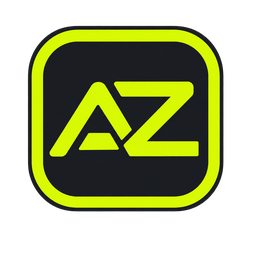
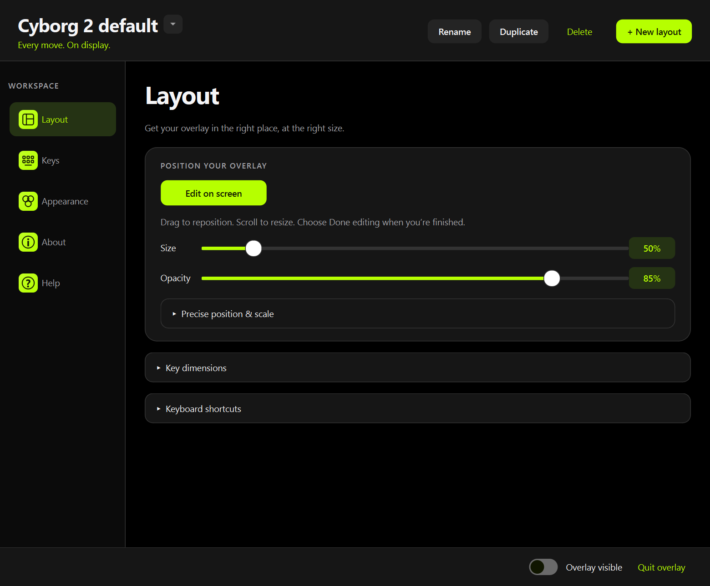
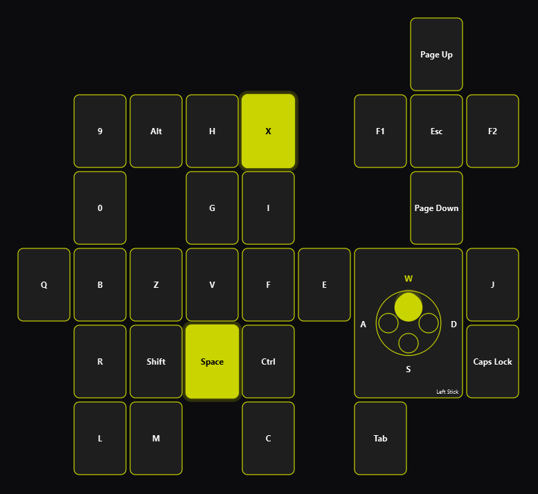
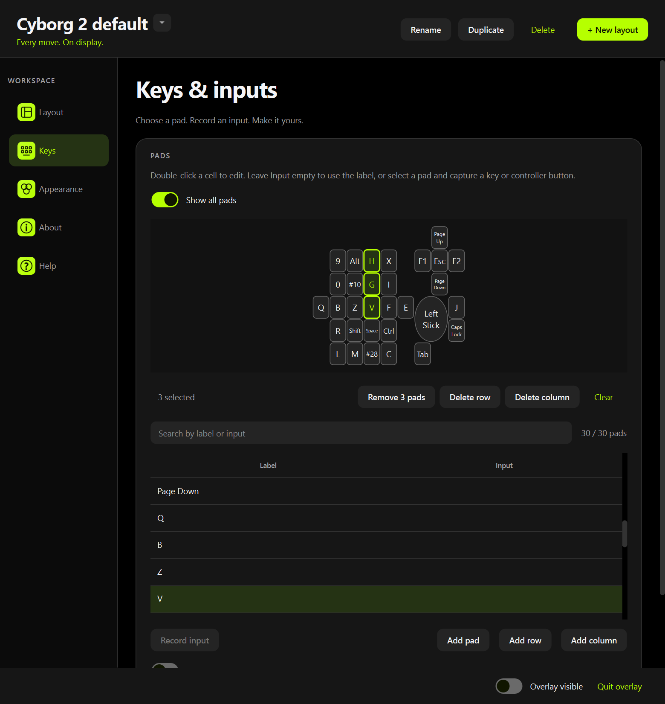
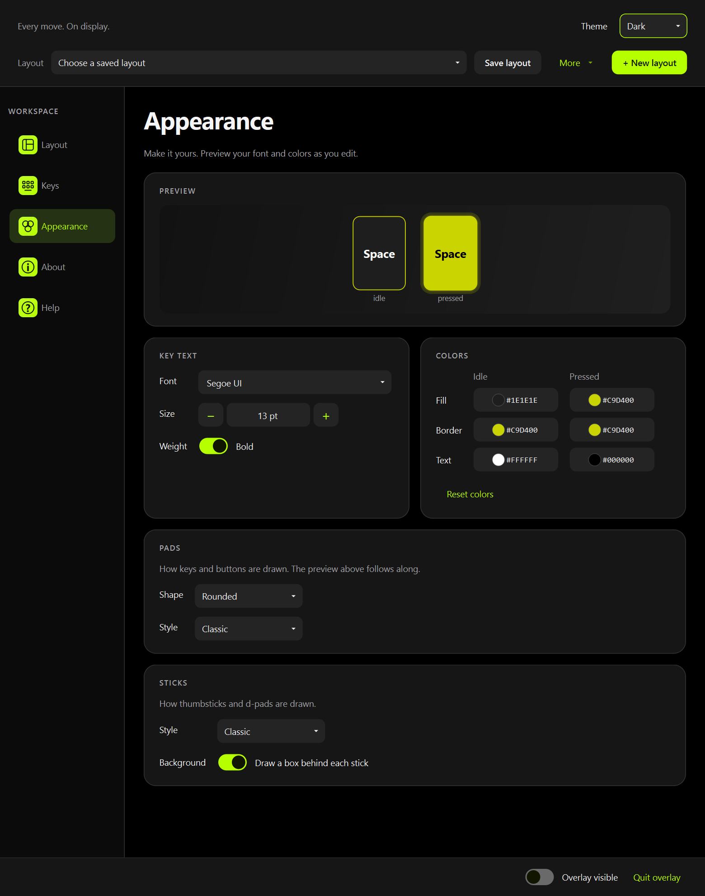
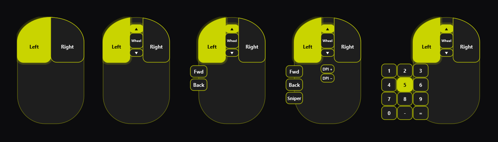

<div align="center">
  
  <h1>AZ-Overlay</h1>
  <p>A customizable input overlay for Azeron keypads, keyboards, and controllers.</p>
  <p><strong>Windows · Transparent · Click-through · Live editing</strong></p>
  <p>
    <a href="#get-started">Get started</a> ·
    <a href="#make-it-yours">Customize</a> ·
    <a href="#supported-devices">Devices</a> ·
    <a href="#build-an-executable">Build</a> ·
    <a href="#support-az-overlay">Donate</a>
  </p>
</div>

<br>



Show your inputs as you play. Keys light up when pressed and fade on release;
controller sticks and triggers animate as they move. The overlay stays above
your game and lets clicks pass through during normal use.



## Get started

Install Python on Windows, open a terminal in the project folder, and run:

```powershell
python -m pip install -r requirements.txt
python overlay.py
```

For analog sticks and controller input, also install the optional controller backend:

```powershell
python -m pip install pygame-ce
```

Once dependencies are installed, double-click **run.bat** to launch without a
console window. Open settings by double-clicking the tray icon or pressing
**Ctrl + Alt + S**.

## Make it yours

### 1. Choose a layout

Select **+ New layout**, choose your device and template, and give it a name.
Switch between saved layouts using the selector at the top of settings.

### 2. Position the overlay

On **Layout**, select **Edit on screen**. Drag to move, scroll to resize, then
select **Done editing**. Use the **Size** and **Opacity** sliders for quick
adjustments. Expand **Precise position & scale**, **Key dimensions**, or
**Keyboard shortcuts** when you need finer control.

While editing on screen, click a pad and press an input to rebind it.
Right-click a pad to clear it.

### 3. Map your inputs



On **Keys**, find and select a pad, choose **Record input**, then press a key or
controller button. Use **Cancel recording** to stop; leaving the page also
cancels recording.

Double-click a cell to edit it directly. **Label** controls the displayed text;
**Input** controls what lights it up.

| Input | Example | Behavior |
| :--- | :--- | :--- |
| Single key | `F5` | Lights while the key is held |
| Any of several keys | `F5, F6` | Lights when either key is held |
| Key combination | `Ctrl+Shift+K` | Requires the combination |
| Controller button | `gp:a` | Uses the controller input |
| Mouse button | `Mouse 4` | Left, Right, Middle, 4 and 5 |
| Scroll wheel | `Wheel Up` | Lights briefly on each tick; `Wheel Down` for the other way |
| Physical key | `sc:0x1e` | Matches a keyboard position by scancode |

An empty input uses the label as its binding. An empty label and input hide the
pad. Enable **Edit position & size** to reveal geometry columns, or expand
**Sticks & d-pads** to configure directional controls.

Turn on **Show all pads** for a clickable layout that includes blank pads.
Click a pad to select its mapping in the table. **Add row** adds blank pads
below the layout; **Add column** adds them to the right. Both reveal the layout
automatically so you can select and assign the new pads.

### 4. Set the style



On **Appearance**, adjust the font, size, weight, and colors. The live preview
shows idle and pressed states, each with its own fill, border, and text color.
The size you pick is the maximum: long labels shrink automatically so text
always stays inside its pad, including on round buttons.

Under **Pads**, pick the shape (rounded or circle) and a style: **Classic**,
**Outline** (see-through until pressed), **Keycap** (raised face), **Underline**
(flat tile with a status bar), or **Pill**. Under **Sticks**, choose how
thumbsticks and d-pads are drawn: **Classic**, **Ring gauge**, **Petals**,
**Vector**, or **Key cross**, and whether a box is drawn behind each stick. All
of it is saved with the layout.

Choose **Light** or **Dark** in the **Theme** selector at the top of settings.
Your choice applies immediately and is remembered across restarts and layout
changes. It controls the settings window; overlay colors are set separately.

> **Every change is saved automatically.** A layout always lives in its own file,
> and the app reopens your last selected layout at startup.
> Layout names are unique: creating one with a name already in use adds "(2)".
> **More → Rename layout…** renames it, **More → Duplicate layout…** keeps a
> separate copy, and **More → Delete saved layout…** removes a layout and
> switches to the next one (deleting the last layout brings back the bundled
> default).

## Supported devices

| Device | Templates |
| :--- | :--- |
| **Azeron** | Cyborg II, Cyborg II Compact, Cyborg, Cyborg Compact, Keyzen, Cyro, Classic, Compact |
| **Keyboards** | 100%, 1800, 96%, 80% TKL, 75% and 65% exploded or compact, 60%, 50%, 40% |
| **Mouse** | 2, 3, 5 and 8 buttons, and an MMO mouse with a 12-key thumb plate |
| **Controllers** | Xbox and PlayStation, with analog sticks and triggers |



Keyboard templates include US (ANSI), UK, German, French, and Spanish (ISO)
layouts. Azeron templates support keys and an analog thumbstick; the Cyro
template also supports mouse-button highlighting. Mouse templates show scroll
ticks above and below the wheel; the MMO thumb plate uses the 1–9, 0, −, = keys
that Naga and G600 style mice send by default. DPI and sniper buttons start
unbound, so record an input for them on **Keys**.

## Keyboard shortcuts

| Default shortcut | Action |
| :--- | :--- |
| **Ctrl + Alt + O** | Show or hide the overlay |
| **Ctrl + Alt + S** | Open settings |
| **Ctrl + Alt + E** | Edit on screen (drag to move, scroll to resize); Esc or the same key ends it |
| **Ctrl + Alt + Q** | Quit |

Change the final key under **Layout → Keyboard shortcuts**. The **Ctrl + Alt**
modifiers stay fixed.

## Settings and saved layouts

| Run mode | Working settings | Named layouts |
| :--- | :--- | :--- |
| From source | `config.json` in the project folder | `profiles/` |
| Packaged executable | `%APPDATA%\az-overlay\config.json` | `%APPDATA%\az-overlay\profiles\` |

Replacing or rebuilding the executable preserves your saved settings. Back up
the data folder to keep a copy of your layouts.

<details>
<summary><strong>Editing the configuration manually</strong></summary>

Close the app before editing `config.json` so live settings do not overwrite
your changes.

| Field | Controls |
| :--- | :--- |
| `x`, `y` | Screen position |
| `scale` | Overall size; `0.5` is half size |
| `opacity` | Overlay opacity, from `0` to `1` |
| `cell_w`, `cell_h`, `gap` | Base key dimensions and spacing |
| `keys` | Labels, input bindings, positions, dimensions, and shapes |
| `decor` | Silhouettes drawn behind the pads, such as a mouse body |
| `pad_style`, `shape` | How keys are drawn: `classic`, `outline`, `keycap`, `underline`, `pill`; `rect` or `circle` |
| `stick_style`, `stick_box` | Stick look: `classic`, `ring`, `petals`, `vector`, `keys`; box behind each stick |
| `sticks` | Direction bindings, analog axes, click input, and geometry |
| `font` | Family, maximum point size at scale `1.0`, and bold weight |
| `colors` | Idle and pressed fill, outline, and text colors |
| `hotkeys` | Final key for each global shortcut |
| `theme` | Settings window appearance: `dark` (default) or `light` |

Key and stick geometry uses `col`, `row`, `w`, and `h` in key units. Named
layouts store appearance, geometry, and bindings; keyboard shortcuts and the
app theme remain global.

</details>

## Build an executable

Install the app dependencies above, then install the build tools:

```powershell
python -m pip install pyinstaller pillow pygame-ce
.\build.bat
```

The result is **dist\AZ-Overlay.exe**. Python is not required on the computer
running the packaged app.

To launch at login, place a shortcut to the executable in the folder opened by
**Win + R → `shell:startup`**.

## Development

Built with **PySide6** for the interface, **pynput** for keyboard and mouse
input, and the optional **pygame-ce / SDL** backend for controllers.

```powershell
python -m pip install pytest
python -m pytest -q
```

## Compatibility

- Use **windowed or borderless** display mode. Exclusive fullscreen can hide the overlay.
- Controller input uses SDL's game-controller mappings. Detection depends on the device and its driver.
- The app uses global input hooks. Check your game's rules before using it with anti-cheat software.

## Support AZ-Overlay

Enjoying the overlay? A donation helps support its development. Thank you!

<!-- Wrap the PayPal badge in a link once the creator's PayPal URL is available. -->
<p>
  
  <a href="https://venmo.com/andrespc93"></a>
</p>

Donate on Venmo to **@andrespc93**. The PayPal donation link is coming soon.

## License

MIT. Uses PySide6, pynput and pygame-ce (LGPL) as separate libraries.
